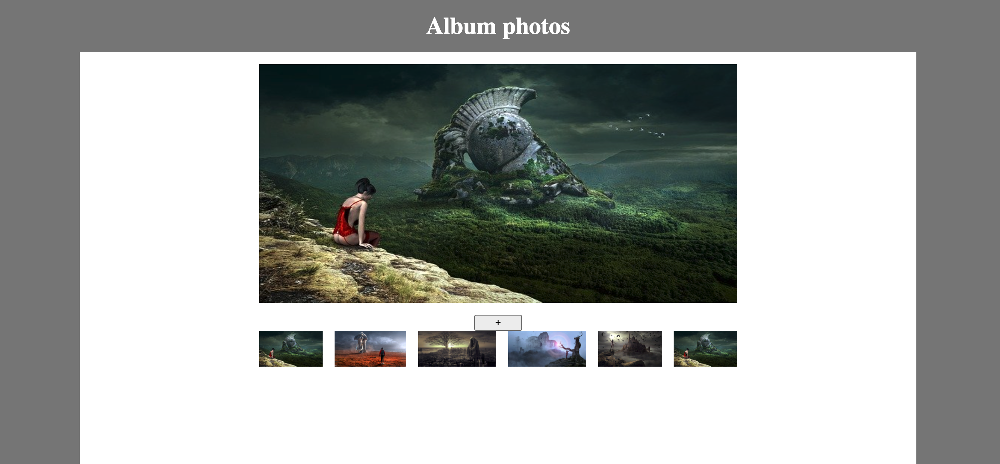

# TP Gallerie photo

Nous allons créer une petite gallerie photo dynamique. Une maquette est fournie, assez basique.

Nous avons fourni 5 images mais vous êtes libre de les modifier.

- La première étape va être de n'afficher que la première image en grand ainsi qu'en vignette.
- Ensuite, un événement click sur le bouton "+" permettra d'ajouter la vignette suivante (la 2). On devra ensuite afficher la 3 et ainsi de suite. On devra utiliser un compteur pour savoir quelle vignette on doit afficher. On peut également compter le nombre d'éléments dans le DOM avec `$('.element').length`.
  Pour ajouter la vignette, on ajoutera l'élément en dynamique en jQuery (https://www.w3schools.com/jquery/jquery_dom_add.asp)
  On remplacera également l'image en grand par cette nouvelle image (https://api.jquery.com/attr/)
- Quand on a 6 vignettes sur la page, on ne bloque pas l'ajout mais on réinitialise les vignettes (on peut supprimer le contenu d'une div en jQuery) et on recommence à ajouter la première vignette puis la 2ème...
- Au clic sur une vignette, l'image remplace celle qui est en en grand format
- Quand 10 vignettes ont été montrées, le bouton "+" disparaît
